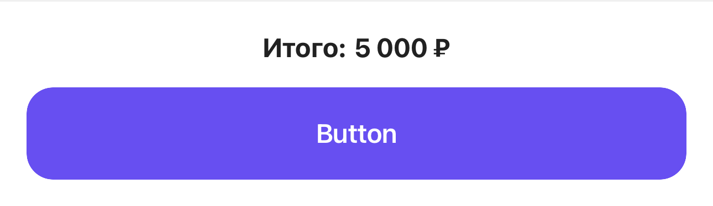

[RU](../../ru/cases/design-system.md) · [Language selection](../../../README.md)

# Shared UI components and the move to UI 2.0

**2022–2026 · OneTwoTrip / iOS**

I developed shared styles and components used by several product teams.

[View screens and states](#screens) · [Full gallery](../gallery.md)

## Context

Changing a basic input field or button affects many screens. My work included API consistency, consumer migration, state handling and checking designs across device sizes.

## My contribution

- Simplified shared button styles, updated the palette and migrated the app to new styles; removed unused components.
- Developed input fields and search fields, including a compact variant, input states, errors, disabled behavior and icons. Investigated existing text-field implementations before consolidation.
- Extended selection fields, segmented controls and floating buttons; built a shared profile widget.
- Added information blocks and bottom action bars variants for UI 2.0 with long text, prices, buttons and loading states.
- Updated component usage in profiles, travel history, search forms and fare selection.

## Technologies

Swift, UIKit, SwiftUI interoperability, Props, PinLayout, Design tokens / styles, SnapshotTesting, XCTest, Accessibility identifiers.

## Practical examples

| Scenario | My contribution | Engineering focus |
| --- | --- | --- |
| Consistent input fields | Developed input fields and search fields with errors, disabled states, icons and compact presentation. | A shared component&#x27;s contract and states. |
| Selection fields and controls | Extended selection fields, the segmented control and floating buttons. | Interface composition across screens. |
| Bottom action bar | Added bottom action bars variants with prices, long text, buttons and loading. | Flexible layout and action states. |
| New styles across the app | Updated buttons, the palette and component consumers in product modules. | A staged migration in a large application. |

## Engineering decisions

- A component describes visual state through Props; business rules remain with its consumer.
- New forms preserved legacy-screen compatibility. A compact search field was separated when its purpose was genuinely different.
- Reusable UI must handle long values, errors, disabled, editing and loading states, and small screens as well as defaults.

## Quality and checks

- Dedicated snapshot work covered input fields; current baselines include different sizes and states of input fields, search fields, selection fields and bottom action bars.
- When changing a shared component, I considered its consumers and checked the relevant visual states.

## Outcome and scope

My contribution was developing individual foundational components and integrating them into product journeys. The architecture and design system were built by the team.

## Screens and interface states

Original snapshot-test images using prepared data. Each example identifies its source type. Design and overall architecture were team work; my contribution is described above. Select an image to inspect the details.

| Shared input field | Shared selection field |
| :---: | :---: |
|  |  |

| Price and action bottom bar |
| :---: |
|  |

Image context and notes

- **Shared input field.** A shared input field reused in product forms. _Original component snapshot using test data._
- **Shared selection field.** A selection field with consistent value and state presentation. _Original component snapshot using test data._
- **Price and action bottom bar.** Price and the primary action form a reusable component. _Original component snapshot using test data._

[Full screen and component gallery](../gallery.md)

## Topics for an interview

- Where is the boundary between a shared component and product logic?
- How do you migrate component consumers while preserving every relevant state?

[All cases](index.md) · [Practical examples](../archive/index.md) · [Technologies](../engineering/technologies.md)
