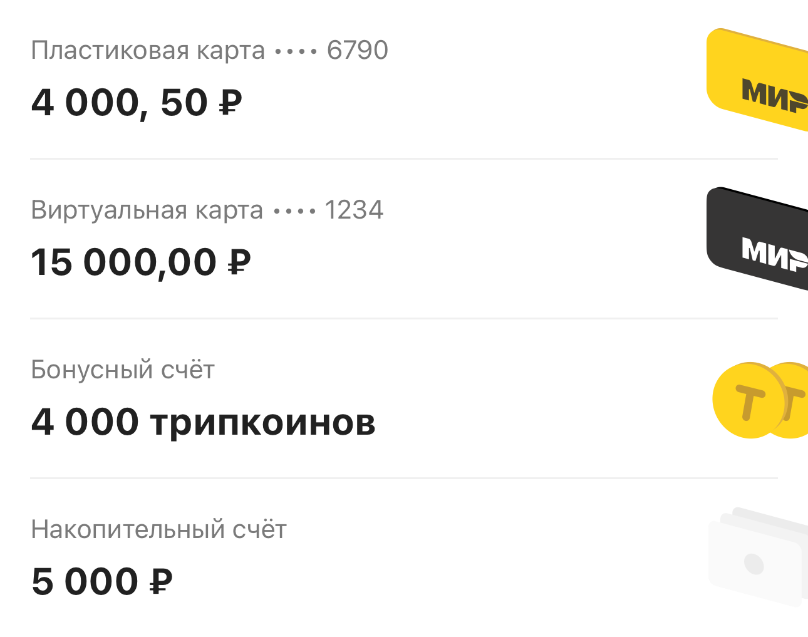
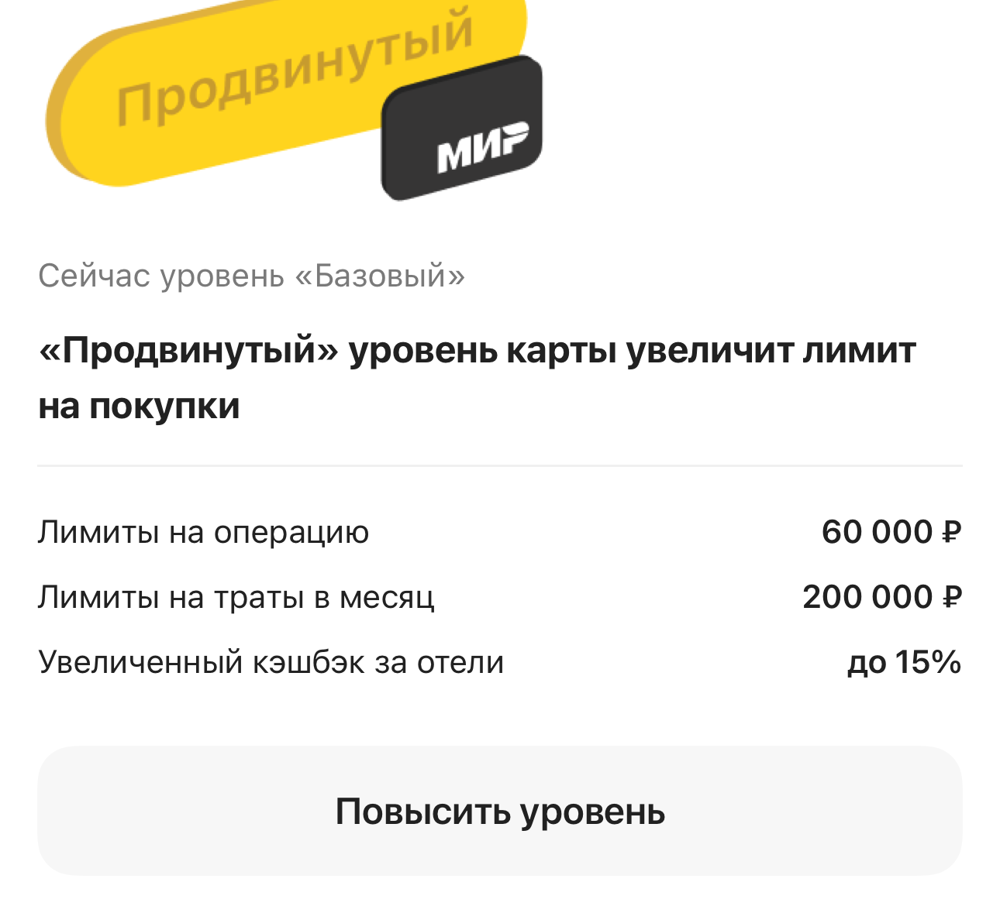

[RU](../../ru/cases/loyalty.md) · [Language selection](../../../README.md)

# Cashback and accounts: balances, cards and screen states

**2023–2025 · OneTwoTrip / iOS**

Developed Solar Cash and migrated the cashback section to UI 2.0: UIKit, TCA, multiple data sources, card and bonus balances, statuses and error handling.

[View screens and states](#screens) · [Full gallery](../gallery.md)

## Context

Loyalty depends on user status, available bonuses, cards and account state. The screen must explain conditions and offer the correct actions even with incomplete data or a network error.

## My contribution

- Added Solar Cash to the profile, credit/debit history, empty states and hotel-flow bonus integration.
- Moved OTT cashback to UI 2.0: header, virtual/physical cards, Tripcoins, travel cashback, boosted cashback, information blocks and banners.
- Separated legacy and new screens, added configuration, a feature flag and error handling, then removed the old implementation.
- Wrote and maintained tests for different statuses, card issuance, missing connectivity, invalid backend responses and updates after card-tier changes.

## Technologies

Swift, UIKit, TCA, Swift Concurrency / async-await, PropsBuilder, Swinject, REST / mapping, SnapshotTesting, XCTest, XCUITest.

## Practical examples

| Scenario | My contribution | Engineering focus |
| --- | --- | --- |
| Solar Cash balance | Added credit/debit history, empty states and hotel integration. | Financial data within a product interface. |
| New cashback screen | Migrated card, Tripcoin and boosted-cashback blocks to UI 2.0. | Migrating a complex screen while preserving rules. |
| Controlled UI rollout | Separated old and new implementations and added configuration and a feature flag. | Incremental introduction of changes. |
| Edge states | Checked card statuses, network errors and updates after tier changes. | Systematic checks of financial journeys. |

## Engineering decisions

- The cashback redesign had to preserve financial rules: functionality remained consistent while the visual styles changed.
- User status and card capabilities form a state matrix. Checking a single successful screen is insufficient.
- After issuing or upgrading a card, the parent section must refresh its data rather than merely dismissing the child screen.

## Quality and checks

- Developed unit, snapshot and UI checks for loyalty tiers, information blocks, errors and navigation.
- UI tests connect product actions to the resulting screen state.

## Outcome and scope

Financial user states gained an updated presentation and systematic checks. Revenue or program-adoption gains are not claimed without product analytics.

## A closer look at the journey

1. **Check the session.** Separate the guest state from loading personal financial data.
2. **Assemble the data.** Fetch configuration plus account, card, loyalty-status and cashback data.
3. **Build the blocks.** Show the appropriate balances, terms and actions for the card and user state.
4. **Refresh after an action.** Synchronise the parent screen after card issuance or an upgrade.

A simplified route through one journey. Error branches and additional actions are discussed below.

### One screen, multiple independent sources

Cashback combines card balances, tripcoins, a savings account, loyalty status, offers and banners. I migrated these blocks to UI 2.0 and integrated configuration and error handling. In the TCA implementation, data from several services loads through async/await and TaskGroup after configuration, while a PropsBuilder produces UIKit components from state. Money and bonus units have different representations, and each balance remains associated with its own account.

### A matrix of card and user states

A virtual card has presence and upgrade-eligibility states; a physical card can be absent, pending, issued or failed. These states determine the copy, balance presentation and available navigation. I worked on the card and higher-cashback blocks, including refreshing the screen after issuance and upgrades. The challenge is keeping the parent screen consistent with the result of a child journey. [Card account, limits and operations](virtual-card.md).

### Network errors and financial-interface checks

Empty data, a guest session, no connection and malformed service responses need distinct checks. I implemented error handling and developed unit, snapshot and UI tests for the section. The code tracks authorisation, loading and network availability separately; signing out resets personal state. Snapshot tests cover the accounts block and higher-cashback variants at different widths, while UI scenarios cover statuses and refresh after actions.

## Screens and interface states

Original snapshot-test images using prepared data. Each example identifies its source type. Design and overall architecture were team work; my contribution is described above. Select an image to inspect the details.

| Cashback: cards and accounts | Higher cashback and card limits |
| :---: | :---: |
|  |  |

| Progress toward Premium status |
| :---: |
|  |

Image context and notes

- **Cashback: cards and accounts.** Cashback-screen block with physical and virtual cards, a bonus account and a savings account. Balances and masked card numbers are snapshot-test fixtures. _Original component snapshot using test data._
- **Higher cashback and card limits.** An upgrade-block state: per-transaction and monthly limits, cashback terms and the next action. This is a UI test example, not current banking terms. _Original component snapshot using test data._
- **Progress toward Premium status.** Counter, progress and status conditions in UI 2.0. An illustration of the loyalty area; the shared design and test baseline are team work. _Snapshot test using prepared data._

[Full screen and component gallery](../gallery.md)

## Topics for an interview

- How do you test a screen with several financial states?
- How should a feature flag be used when replacing an existing section?

[All cases](index.md) · [Practical examples](../archive/index.md) · [Technologies](../engineering/technologies.md)
