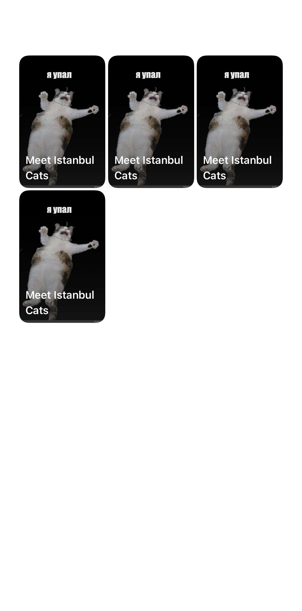
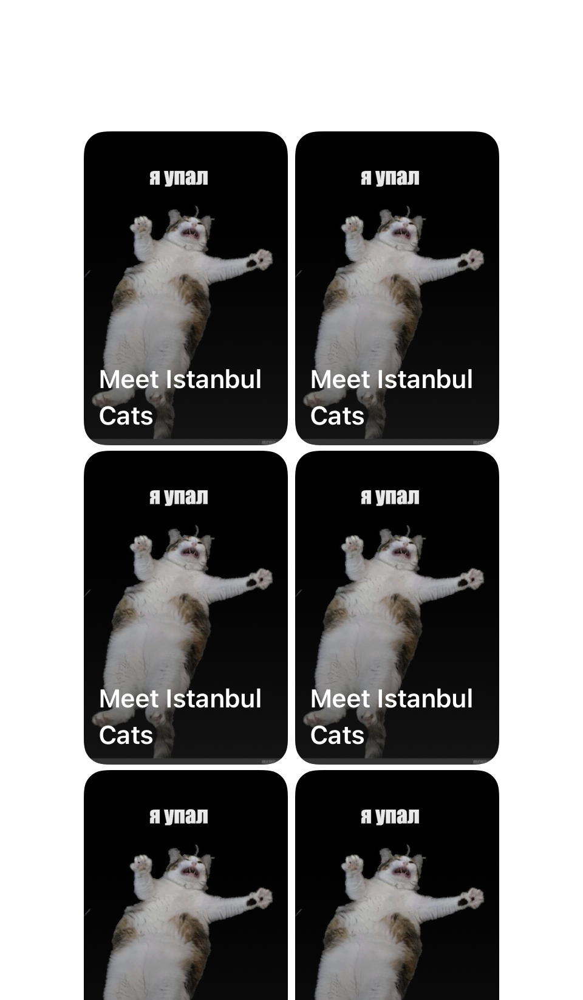

[RU](../../ru/cases/stories.md) · [Language selection](../../../README.md)

# Stories: architecture, video and interactive journeys

**2024–2026 · OneTwoTrip / iOS**

I moved Stories to TCA and developed interactive behavior, video loading and giveaway participation.

[View screens and states](#screens) · [Full gallery](../gallery.md)

## Context

A stories viewer has more than a slide sequence: viewed and saved items, video, external actions, authentication and a route that can change dynamically. Changes must preserve progress and dismissal behavior.

## My contribution

- Separated preview, slides, catalog and infrastructure; moved state to TCA and integrated the new modules into existing screens.
- Added and corrected analytics events, saved stories and return-to-preview behavior.
- Fixed dynamic-story playback and video caching; moved to bounded preloading rather than preparing every slide upfront.
- Developed the Hotel Wednesday giveaway: a decision slide, backend participation, authentication over the story, dynamic branches and promo-code copying.
- Added successful-authentication events from Stories and worked on UI compatibility during migration.

## Technologies

Swift, UIKit, TCA, Combine, AVFoundation / video integration, Nuke, Swinject, REST, XCTest / SnapshotTesting / XCUITest.

## Practical examples

| Scenario | My contribution | Engineering focus |
| --- | --- | --- |
| Separating Stories modules | Moved state to TCA and separated catalog, preview, slides and infrastructure. | Architectural migration of an existing feature. |
| Preparing video | Replaced loading every slide upfront with bounded media preparation. | Resource management in a media journey. |
| Interactive giveaway | Developed the decision slide, backend participation and dynamic branches. | A journey driven by user choices and effects. |
| Sign-in over a story | Worked on authentication, return to viewing and successful-sign-in analytics. | Preserving context across external navigation. |

## Engineering decisions

- Catalog, storage, slide viewing and preview presentation have separate responsibilities, allowing one journey to change without rewriting every integration.
- Interactive-story progress follows the available route rather than the initial slide count. Authentication and backend responses can change that route.
- Limited preloading reduces the amount of work before display; no measured speedup in milliseconds is claimed.

## Quality and checks

- Current tests cover reducers, props, analytics, universal links and previews; UI tests check the interactive journey.
- Migration work separately considered compatibility and the correctness of existing journeys.

## Outcome and scope

Stories gained clearer state architecture and support for complex product journeys, including branching and returning from authentication.

## A closer look at the journey

### One feature, several responsibilities

Previews, the saved collection, slide playback and the shared repository have different responsibilities. During the TCA migration I separated them and integrated the new modules into existing entry points. The full-screen snapshots below show the collection with content, empty state and a compact layout.

### The route changes during playback

An interactive slide can trigger authentication or giveaway participation, and the server response can change the next branch. I worked on this route, returning to playback and analytics. Progress needs to match the available sequence rather than count every original slide mechanically.

### Media preparation is bounded

The change history includes moving from preparing all videos to loading two slides, as well as cache fixes. This demonstrates work on resource use and the media lifecycle. No quantitative speedup is claimed without a separate measurement. Collection screenshots illustrate its UI, not playback or interactive branches.

## Screens and interface states

Original snapshot-test images using prepared data. Each example identifies its source type. Design and overall architecture were team work; my contribution is described above. Select an image to inspect the details.

| Solar Stories: populated collection | Solar Stories on a compact screen |
| :---: | :---: |
|  |  |

| Saved Stories: empty state |
| :---: |
|  |

Image context and notes

- **Solar Stories: populated collection.** A full-screen snapshot with four stories. The repeated cat image is a test fixture. My work included state migration and saved-collection integration. _Snapshot test using prepared data._
- **Solar Stories on a compact screen.** The iPhone SE variant with seven stories: two columns and a collection extending beyond the viewport. _Snapshot test using prepared data._
- **Saved Stories: empty state.** The screen explains how to save a story when the collection is empty. It is a separate presentation state. _Snapshot test using prepared data._

[Full screen and component gallery](../gallery.md)

## Topics for an interview

- How do you preserve viewing context during authentication?
- How does limited video preloading affect the design of the media journey?

[All cases](index.md) · [Practical examples](../archive/index.md) · [Technologies](../engineering/technologies.md)
