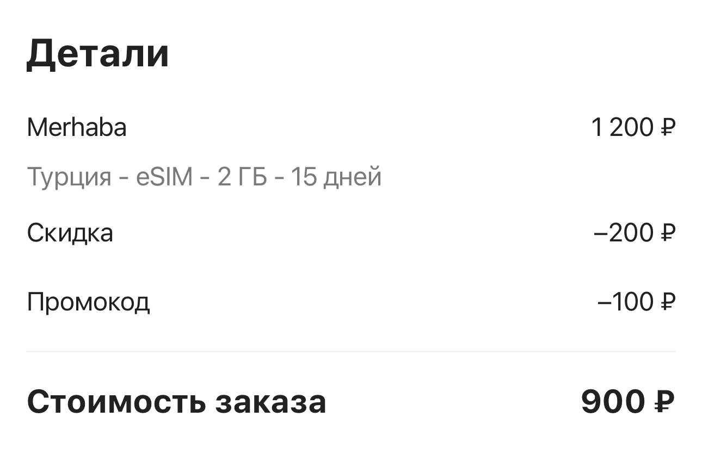
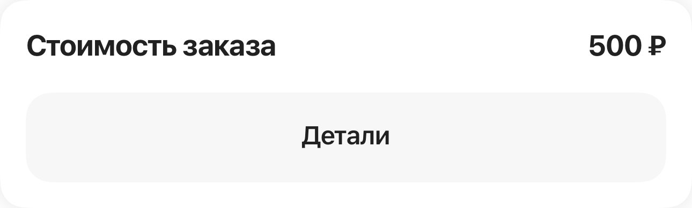
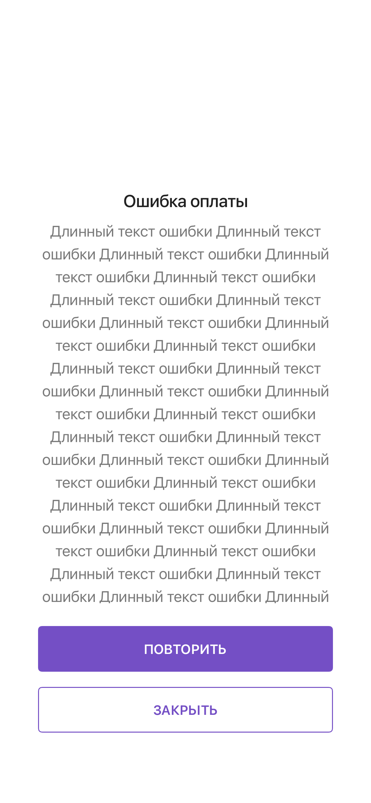
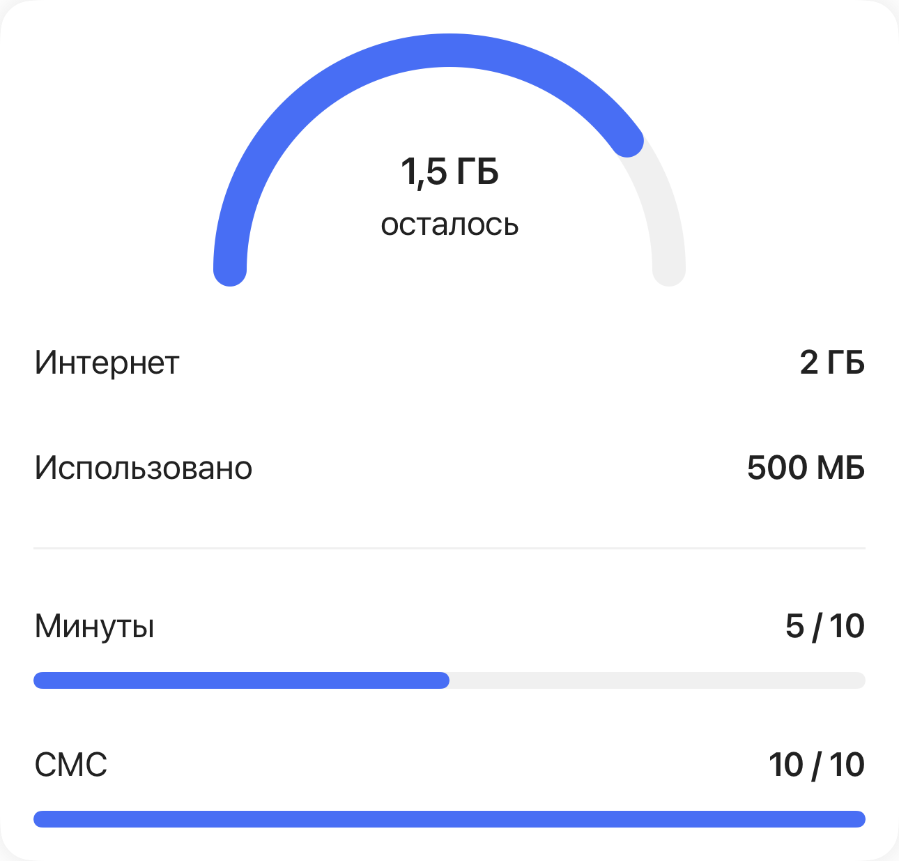
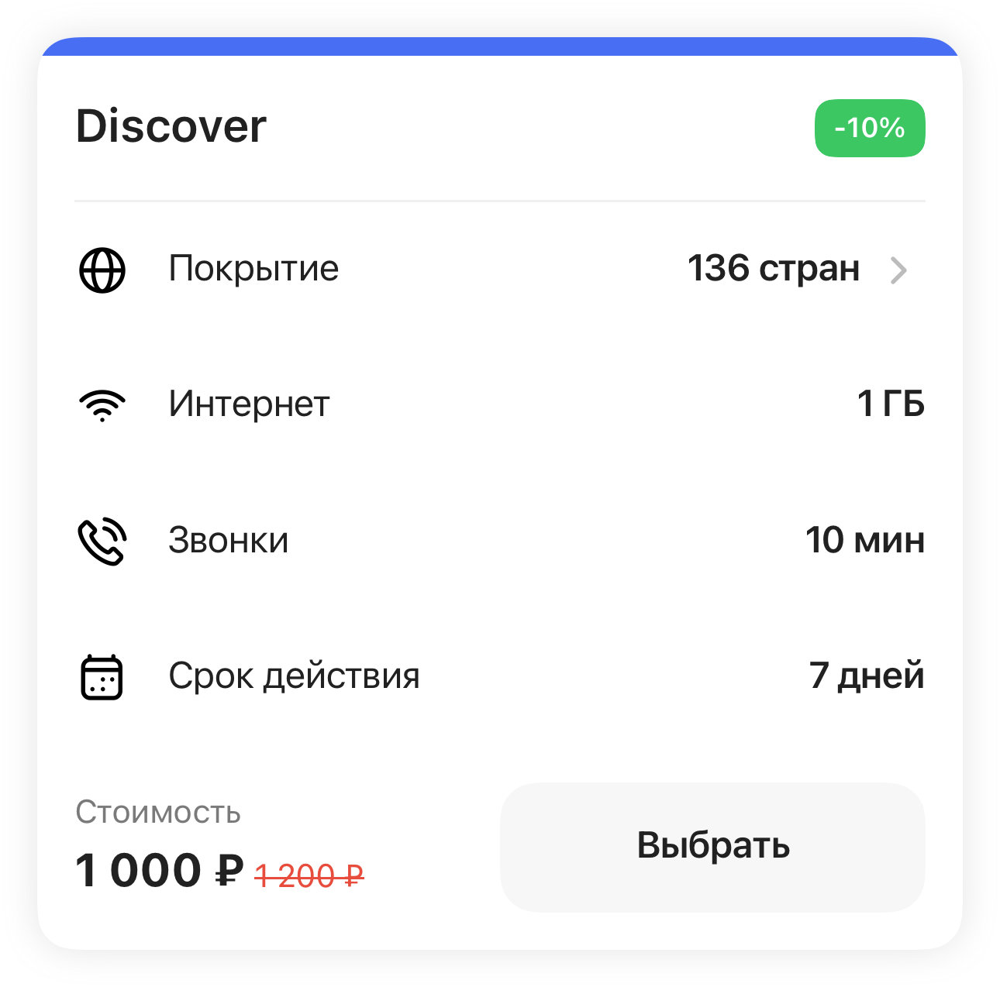
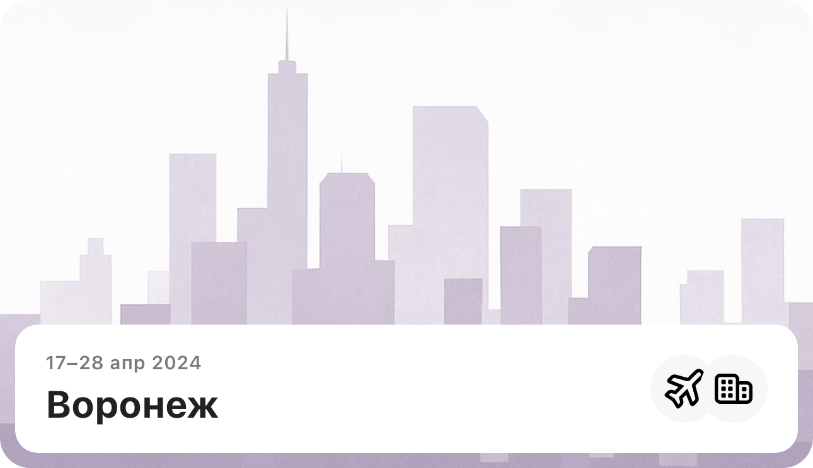
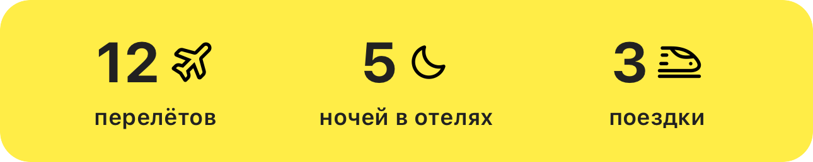
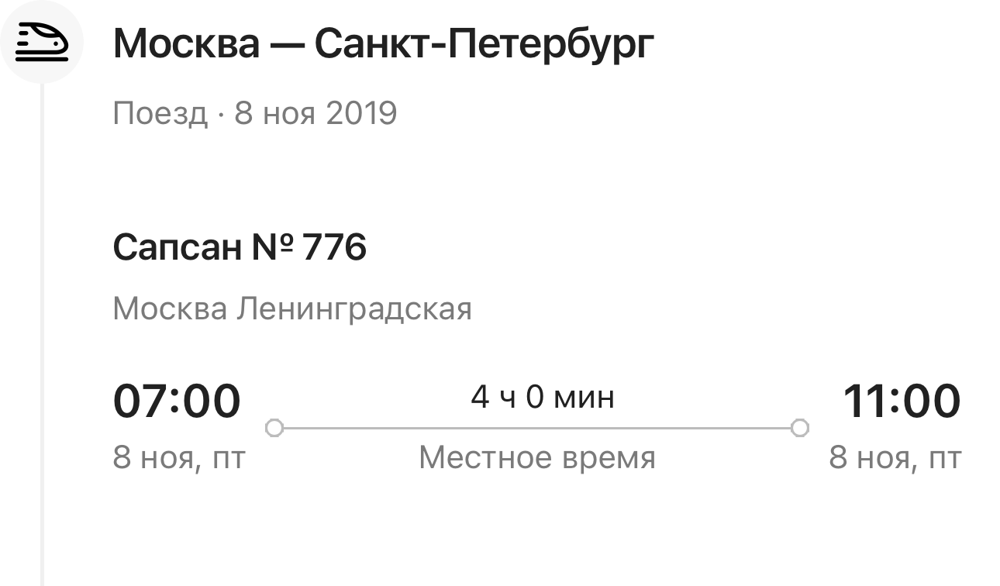
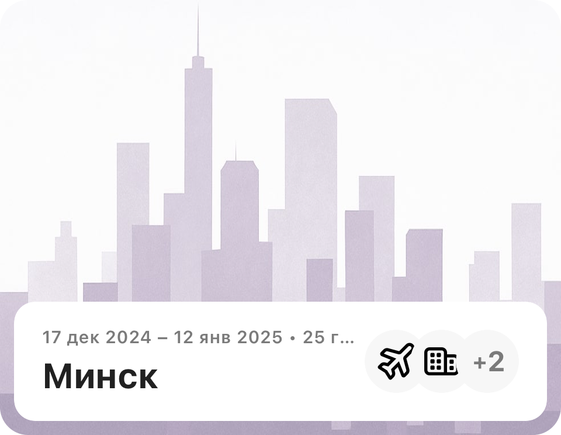
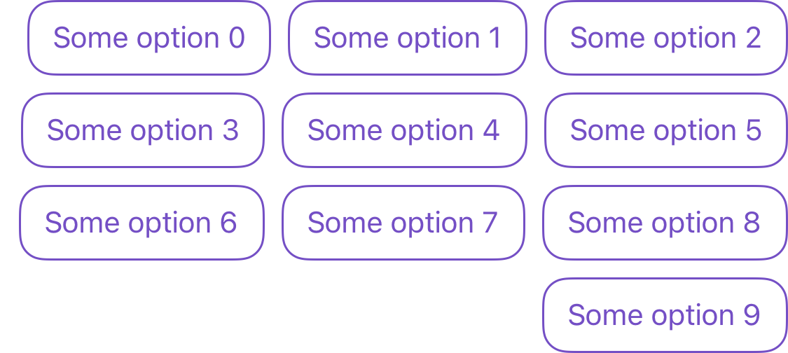

[RU](../ru/gallery.md) · [Language selection](../../README.md)

# Screens and components

Selected screens from my work at OneTwoTrip and Solar. **27 images · 9 areas.** Select a preview to open the original.

[Payments and finance](#financial-screens) · [States](#states) · [Components](#components)

## Payments, balances and cards

Three technical cases with original component snapshots using test data. The cases explain the complete journeys; the images below show individual interface blocks.

### eSIM checkout: pricing and confirmation

SwiftUI · TCA · REST API · 3DS · polling. The price breakdown and final total are two independent checkout-component test states. The case covers promo codes, full discounts, errors and the timer after app resumption.

[Technical breakdown and my contribution](cases/esim.md)

| eSIM price: discount, promo code and total | Total and access to payment details |
| :---: | :---: |
|  |  |

Component notes

- **eSIM price: discount, promo code and total.** Payment breakdown in a bottom sheet: base price, plan discount, promo code and total. Values come from a test fixture; this is a payment-screen component. _Original component snapshot using test data._
- **Total and access to payment details.** A component with the final price and a button opening the breakdown. This is an independent test fixture; its amount differs from the promo-code example. _Original component snapshot using test data._

### Cashback: balances, cards and limits

UIKit · TCA · async/await · REST API. Blocks from one financial screen: multiple accounts and balance units, card statuses and available actions. The case covers data loading, errors and refresh after card issuance.

[Technical breakdown and my contribution](cases/loyalty.md)

| Cashback: cards and accounts | Higher cashback and card limits |
| :---: | :---: |
|  |  |

Component notes

- **Cashback: cards and accounts.** Cashback-screen block with physical and virtual cards, a bonus account and a savings account. Balances and masked card numbers are snapshot-test fixtures. _Original component snapshot using test data._
- **Higher cashback and card limits.** An upgrade-block state: per-transaction and monthly limits, cashback terms and the next action. This is a UI test example, not current banking terms. _Original component snapshot using test data._

### Card account: states and challenging data

UIKit · Props · SnapshotTesting. Two header states: issuance with a locked balance, and a long amount at 320 pt width. The case also explores TCA transaction history: date filtering, pagination, refresh and scrolling.

[Technical breakdown and my contribution](cases/virtual-card.md)

| Card being issued: locked balance | Large balance on a compact screen |
| :---: | :---: |
|  |  |

Component notes

- **Card being issued: locked balance.** Account header showing issuance status and a locked-balance indicator. Status and fund availability need to remain distinct from the amount. _Original component snapshot using test data._
- **Large balance on a compact screen.** Snapshot at 320 pt width: a large test balance, fractional amount, currency and card icon. An example of adapting text size to a long balance. _Original component snapshot using test data._

## Interface states

Supporting scenarios: empty data, waiting, compact screens and recovery.

Stories — collection, iPhone SE, empty state

| Solar Stories: populated collection | Solar Stories on a compact screen | Saved Stories: empty state |
| :---: | :---: | :---: |
|  |  |  |

- **Solar Stories: populated collection.** A full-screen snapshot with four stories. The repeated cat image is a test fixture. My work included state migration and saved-collection integration. _Snapshot test using prepared data._
- **Solar Stories on a compact screen.** The iPhone SE variant with seven stories: two columns and a collection extending beyond the viewport. _Snapshot test using prepared data._
- **Saved Stories: empty state.** The screen explains how to save a story when the collection is empty. It is a separate presentation state. _Snapshot test using prepared data._

[Full case](cases/stories.md)

Payments — waiting and error

| Waiting for external payment | Payment error: long text and two actions |
| :---: | :---: |
|  |  |

- **Waiting for external payment.** A full-screen snapshot of the shared payment container. It shows waiting for a banking-app handoff; this is the SberPay variant, not a screenshot of SBP specifically. _Snapshot test using prepared data._
- **Payment error: long text and two actions.** Stress-test data checks how a long message coexists with Retry and Close actions. _Snapshot test using prepared data._

[Full case](cases/payments.md)

## Components

Smaller elements grouped by product area.

eSIM · 2

| eSIM balance | eSIM plan card |
| :---: | :---: |
|  |  |

- **eSIM balance.** Remaining allowance and service status in a compact block. _Original component snapshot using test data._
- **eSIM plan card.** The card brings plan terms and the selection action together. _Original component snapshot using test data._

[Full case](cases/esim.md)

Travel cards and timeline · 5

| Trip card | Trip timeline item |
| :---: | :---: |
|  |  |

| Travel statistics | Rail timeline item |
| :---: | :---: |
|  |  |

| Trip card: long dates and several travel types |
| :---: |
|  |

- **Trip card.** A reusable card combines cover art, dates, destination and travel types. _Original component snapshot using test data._
- **Trip timeline item.** A route item combines the shared timeline with transport-specific presentation. _Original component snapshot using test data._
- **Travel statistics.** Travel statistics are reused across several parts of the feature. _Original component snapshot using test data._
- **Rail timeline item.** A transport widget presents stations, local times and duration within the shared timeline. _Snapshot test using prepared data._
- **Trip card: long dates and several travel types.** A 320 pt variant with a long date range, city count and extra icons. Visible text truncation is part of the tested state. _Snapshot test using prepared data._

[Full case](cases/travel-history.md)

Flights: search and fares · 2

| UI 2.0 flight fare card | Round-trip search form |
| :---: | :---: |
|  |  |

- **UI 2.0 flight fare card.** Fare conditions and the available action follow the shared UI 2.0 style. _Original component snapshot using test data._
- **Round-trip search form.** Round-trip search with linked journey parameters. _Original component snapshot using test data._

[Full case](cases/avia.md)

Shared fields and action bar · 3

| Shared input field | Shared selection field |
| :---: | :---: |
|  |  |

| Price and action bottom bar |
| :---: |
|  |

- **Shared input field.** A shared input field reused in product forms. _Original component snapshot using test data._
- **Shared selection field.** A selection field with consistent value and state presentation. _Original component snapshot using test data._
- **Price and action bottom bar.** Price and the primary action form a reusable component. _Original component snapshot using test data._

[Full case](cases/design-system.md)

Virtual card · 2

| Card limits | Financial operation row |
| :---: | :---: |
|  |  |

- **Card limits.** Limit presentation is part of the virtual card management journey. _Original component snapshot using test data._
- **Financial operation row.** A history component showing purpose, date, time, amount and operation type. The card case explains pagination, filtering and list states. _Original component snapshot using test data._

[Full case](cases/virtual-card.md)

Loyalty programme · 1

| Progress toward Premium status |
| :---: |
|  |

- **Progress toward Premium status.** Counter, progress and status conditions in UI 2.0. An illustration of the loyalty area; the shared design and test baseline are team work. _Snapshot test using prepared data._

[Full case](cases/loyalty.md)

Support chat · 1

| Chat reply options |
| :---: |
|  |

- **Chat reply options.** Quick replies as part of a guided support conversation. _Original component snapshot using test data._

[Full case](cases/chat.md)

---

**About the images.** Design and overall architecture were team work; the cases describe my contribution. Images are unchanged snapshot-test baselines using prepared data. The original interface language is preserved.

[All cases](cases/index.md) · [Summary](career/summary.md) · [About the materials](methodology.md)
