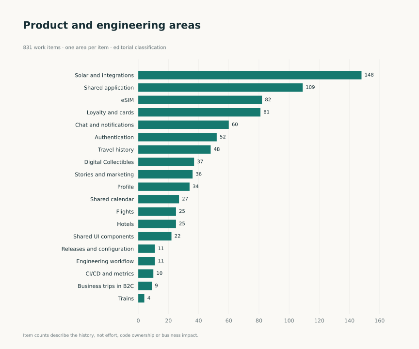

[RU](../ru/overview.md) · [Language selection](../../README.md)

# Valeriy Veselov · iOS Developer

**OneTwoTrip & Solar · 2021–2026**

I develop user journeys in a large modular iOS application, from authentication and shared UI components to eSIM, travel history and payment integrations. My experience also includes automated checks, Jenkins, technical documentation and repository-analysis tools.

This portfolio explains the tasks I worked on, my implementation approach and the engineering skills I applied. Each case provides context, my contribution, practical examples, technical decisions and interview topics.

**Start here:** [summary](career/summary.md) · [gallery](gallery.md) · [all cases](cases/index.md). Every section is available directly on GitHub.

## Choose an area

| Interest | Where to start |
| --- | --- |
| End-to-end product journeys | [eSIM](cases/esim.md), [travel history](cases/travel-history.md), [payments](cases/payments.md) |
| Payments, balances and financial screens | [eSIM: 3DS, promo codes and timer](cases/esim.md), [cashback and accounts](cases/loyalty.md), [cards and transaction history](cases/virtual-card.md) |
| Shared components and UI architecture | [UI 2.0](cases/design-system.md), [calendar](cases/calendar.md), [Stories](cases/stories.md) |
| Developing a separate app | [Solar](cases/solar.md), [Digital Collectibles](cases/digital-collectibles.md) |
| Quality and engineering infrastructure | [Testing](cases/quality.md), [Jenkins](engineering/ci-details.md), [metrics](cases/repository-metrics.md) |
| Experience and technologies | [Professional growth](career/growth.md), [technology matrix](engineering/technologies.md) |

## Full portfolio

- [21 detailed cases](cases/index.md).
- [84 practical examples](archive/index.md): scenario, contribution and engineering focus.
- [7 charts and statistics](statistics.md).
- [Screen and component gallery](gallery.md).
- [Professional summary](career/summary.md).

## Experience in numbers

| Metric | Count |
| --- | ---: |
| Authored code changes excluding merge commits | 4,046 |
| Work items linked to authored changes | 831 |
| Merged authored pull requests in available history | 342 |
| Commits touching test files | 788 |

Analysis period: **December 22, 2021–September 28, 2026**. PR history covers November 2024–September 2026. The figures describe the scale and structure of work, not released-feature counts or business impact. [How to read the metrics](methodology.md).

## Using this portfolio

For an introduction, read the summary and choose two or three cases relevant to the role. Each case includes practical examples and technical discussion topics. The [practical examples catalog](archive/index.md) is grouped by area of work; use page search to find a technology.

The application and design were created by the team. Cases describe my scope; recent infrastructure solutions involving substantial AI assistance explicitly state my role in definition, review and iteration. Illustrations are screen and component snapshots using prepared data; the gallery identifies each source type.
