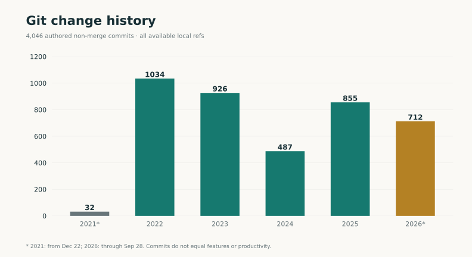
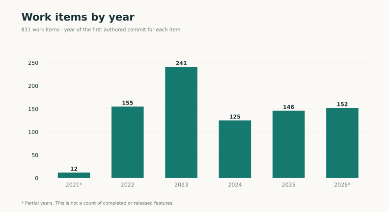
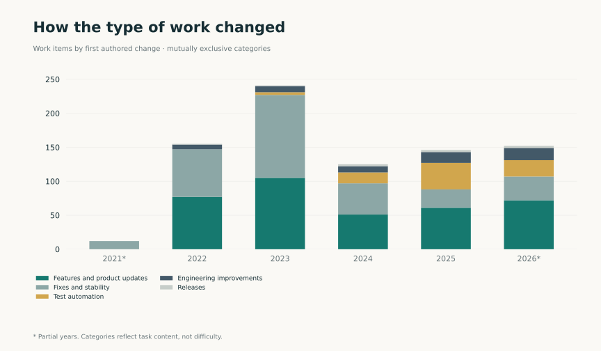
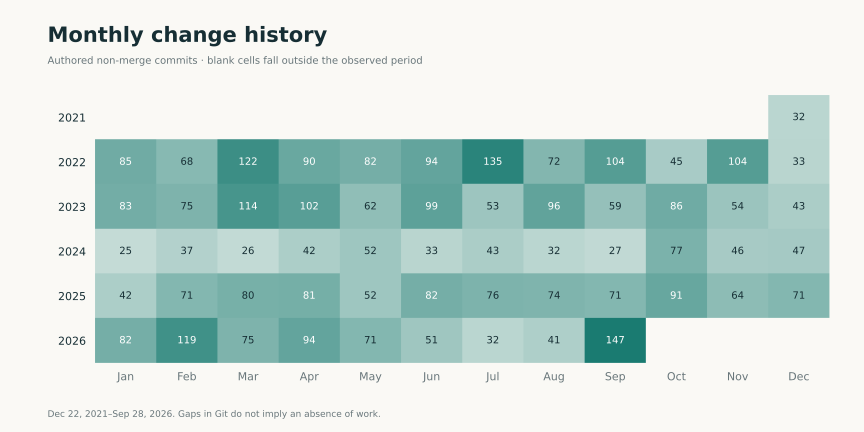
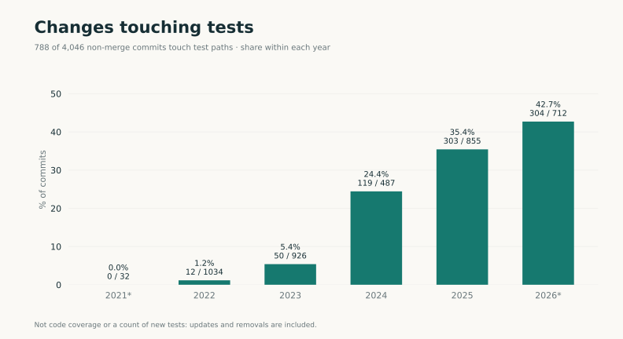
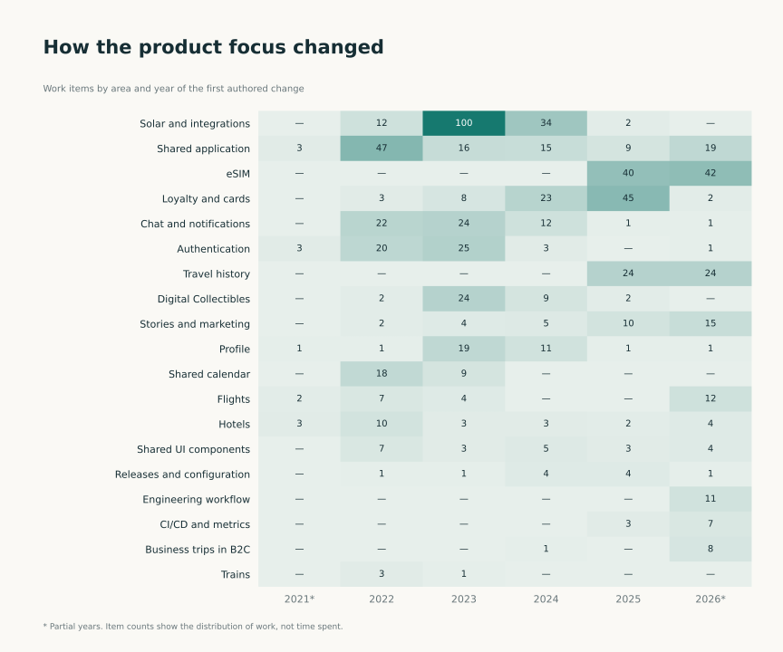

[RU](../ru/statistics.md) · [Language selection](../../README.md)

# Contribution statistics

Period: **December 22, 2021–September 28, 2026**. Charts describe the scale and structure of the engineering history. [Cases](cases/index.md) explain the work and decisions.

## Code changes by year

4,046 authored non-merge commits. Different records can represent backports of the same change.

[PNG](../../assets/charts/en/commits-yearly.png) · [SVG](../../assets/charts/en/commits-yearly.svg)

## Work items by year

831 work items linked to authored code changes. The year represents the first change, not completion.

[PNG](../../assets/charts/en/issues-yearly.png) · [SVG](../../assets/charts/en/issues-yearly.svg)

## Areas of work

Each item belongs to one area; the classification was prepared for this portfolio.

[PNG](../../assets/charts/en/domains.png) · [SVG](../../assets/charts/en/domains.svg)

## Types of work

Features, fixes, checks, engineering changes and releases. Item counts do not reflect effort.

[PNG](../../assets/charts/en/work-mix.png) · [SVG](../../assets/charts/en/work-mix.svg)

## Monthly history

December 2021 and September 2026 are partial. No commits does not mean no work.

[PNG](../../assets/charts/en/monthly.png) · [SVG](../../assets/charts/en/monthly.svg)

## Work involving tests

788 commits touch test paths. This is not code coverage or a count of tests written.

[PNG](../../assets/charts/en/test-work.png) · [SVG](../../assets/charts/en/test-work.svg)

## How product focus changed

Work items by area and year of the first authored change. Each cell shows an item count.

[PNG](../../assets/charts/en/domain-evolution.png) · [SVG](../../assets/charts/en/domain-evolution.svg)

## Data table

| Year | Non-merge commits | Items first changed that year | Commits touching test paths |
| --- | ---: | ---: | ---: |
| 2021* | 32 | 12 | 0 |
| 2022 | 1034 | 155 | 12 |
| 2023 | 926 | 241 | 50 |
| 2024 | 487 | 125 | 119 |
| 2025 | 855 | 146 | 303 |
| 2026* | 712 | 152 | 304 |

*Partial years. [How to read the metrics](methodology.md) · [Aggregate data](../../data/statistics.en.json).
