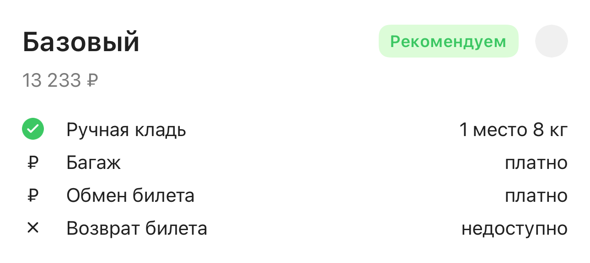
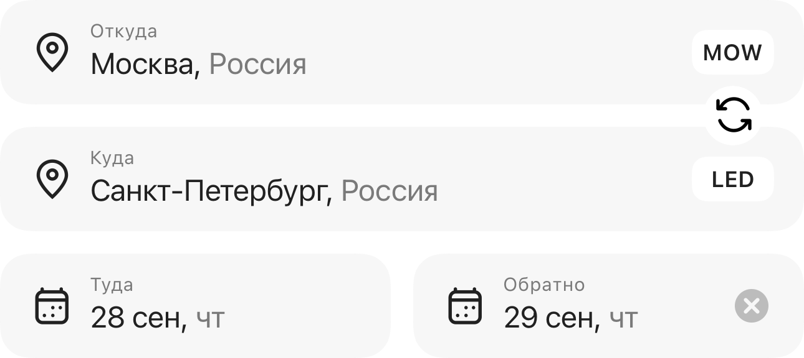

[EN](../../en/cases/avia.md) · [Выбор языка / Language](../../../README.md)

# Авиа: формы поиска, тарифы и сценарии заказа

**2022–2026 · OneTwoTrip / iOS**

Развивал авиационные экраны и участвовал в переходе формы поиска и выбора тарифа на UI 2.0.

[Смотреть экраны и состояния](#screens) · [Вся галерея](../gallery.md)

## Контекст

Пользовательский путь от поиска до тарифа и заказа чувствителен к навигации, состоянию выбранных параметров и корректной цене. Мой вклад включает ранние исправления и поздние комплексные изменения представления.

## Мой вклад

- Исправлял параметры поиска, статусы и переходы заказа, маршрутные документы, фильтры и связанные регрессии.
- Собирал новую форму поиска из общих компонентов, поддерживал простой и сложный маршрут, анимации и BI; добавлял UI-проверки.
- Переводил выбор тарифов на UI 2.0: карточки, состояние выбора, отображение цены, советы, баннеры, ошибки и переход к бронированию.
- Работал над выбором мест в уже оформленном заказе, согласованностью цвета аватаров пассажиров и интеграцией предложения eSIM.

## Технологии

Swift, UIKit, TCA, PropsBuilder, Swinject, Common UI components, Feature flags, XCTest / SnapshotTesting / XCUITest.

## Примеры задач

| Сценарий | Что я делал | Инженерный акцент |
| --- | --- | --- |
| Форма поиска UI 2.0 | Собирал простой и сложный маршрут из общих компонентов, добавлял события и UI-проверки. | Продуктовая форма с несколькими режимами. |
| Выбор тарифа | Переводил карточки, цены, состояние выбора и переход к бронированию на UI 2.0. | Обновление интерфейса с сохранением правил покупки. |
| Сопровождение заказа | Исправлял параметры, статусы, документы, фильтры и переходы. | Работа с регрессиями в длинном продуктовом пути. |
| Дополнительные услуги | Работал над местами в оформленном заказе и предложением eSIM. | Интеграция связанных продуктов в контекст заказа. |

## Инженерные решения

- Новый экран тарифов построен как presentation layer поверх существующей продуктовой логики и backend-контракта.
- Для Solar сохранялось отдельное поведение формы поиска. Редизайн OTT не должен автоматически менять второй продукт.
- Цена, выбранный тариф и параметры перехода должны сохранять согласованность при обновлении UI.

## Качество и проверки

- Добавлял UI-проверки новой формы поиска и тарифов; сопровождал тестами последующие изменения сценариев заказа.
- Отдельные UI-задачи покрывают новую форму поиска и тарифы; поздние исправления заказа имеют собственные тесты и PR.

## Результат и границы

Опыт включает работу на нескольких шагах авиационного пути и миграцию UI без подмены бизнес-правил.

## Экраны и состояния интерфейса

Оригинальные изображения из snapshot-тестов на подготовленных данных. Тип материала указан под каждым примером. Дизайн и общая архитектура создавались командой; мой вклад описан выше. Нажмите на изображение, чтобы рассмотреть детали.

| Карточка авиатарифа UI 2.0 | Форма поиска: туда и обратно |
| :---: | :---: |
|  |  |

Сценарии и пояснения к изображениям

- **Карточка авиатарифа UI 2.0.** Условия авиатарифа и доступное действие в общем визуальном стиле UI 2.0. _Реальный snapshot-baseline компонента на тестовых данных; не снимок production-сессии._
- **Форма поиска: туда и обратно.** Состояние поиска с двумя направлениями и связанными параметрами поездки. _Реальный snapshot-baseline компонента на тестовых данных; не снимок production-сессии._

[Вся галерея экранов и компонентов](../gallery.md)

## Что можно обсудить на интервью

- Как спроектировать общую форму для простого и сложного маршрута?
- Как обновлять UI выбора тарифа, сохраняя бизнес-правила покупки?

[Все кейсы](index.md) · [Практические задачи](../archive/index.md) · [Технологии](../engineering/technologies.md)
