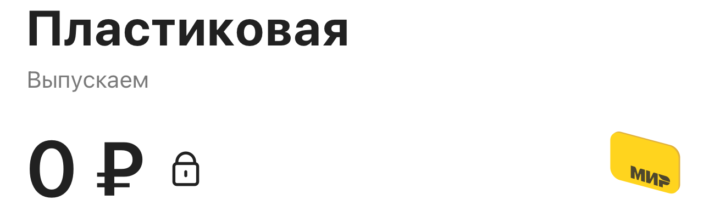
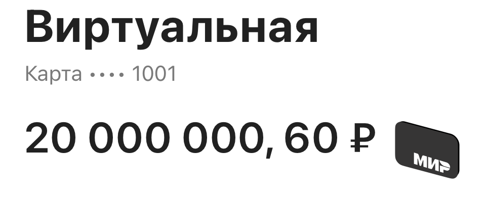
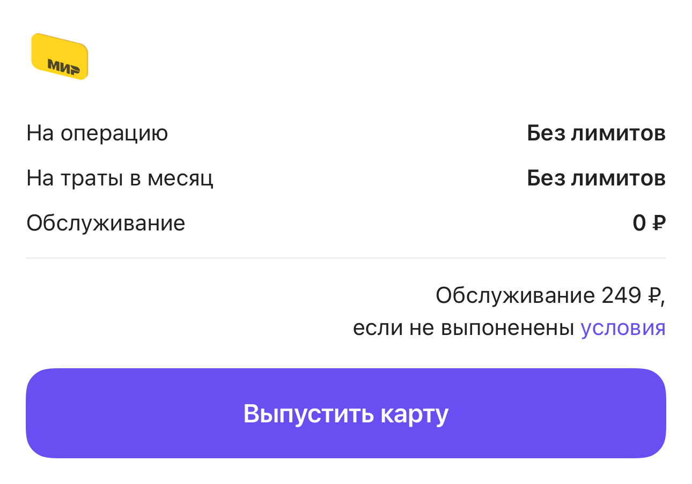

[EN](../../en/cases/virtual-card.md) · [Выбор языка / Language](../../../README.md)

# Карты и история операций: лимиты, пагинация и состояния

**2024–2025 · OneTwoTrip / iOS**

Обновлял кабинет виртуальной и пластиковой карты: UIKit, состояние счёта, лимиты и история операций на TCA с фильтрацией, пагинацией и обновлением списка.

[Смотреть экраны и состояния](#screens) · [Вся галерея](../gallery.md)

## Контекст

Пользователю нужен финансовый раздел с понятным состоянием карты, доступными действиями и ограничениями. Реализация требует работы не только с карточкой на экране, но и с данными счёта, операциями и асинхронным изменением статуса.

## Мой вклад

- Работал над основным экраном виртуальной и пластиковой карты, статусами выпуска пластика и историей операций.
- Реализовывал лимиты на траты, отдельный экран лимитов и информацию об обслуживании.
- Добавлял skeleton-состояния, ошибки через snackbar/bottom sheet, обновлял бизнес-логику и исправлял замечания дизайн-ревью.
- Развивал тесты выпуска, идентификации, обработки 401, истории операций, разных уровней карты и пластика.
- Ускорял отдельные UI-сценарии через целевые диплинки и рефакторил общую тестовую инфраструктуру лояльности.
- Развивал историю операций: фильтрацию по датам, пагинацию, pull-to-refresh, группировку по месяцам и переход к деталям; исправлял поведение пустого списка и прокрутки.

## Технологии

Swift, UIKit, TCA, Presenter / Interactor / Router, REST, Swinject, Props, SnapshotTesting, XCTest, XCUITest.

## Примеры задач

| Сценарий | Что я делал | Инженерный акцент |
| --- | --- | --- |
| Кабинет карты | Работал над виртуальной и пластиковой картой, статусами выпуска и операциями. | Несколько состояний финансового продукта. |
| Лимиты и обслуживание | Реализовывал лимиты трат, отдельный экран и информацию об условиях. | Понятное представление ограничений продукта. |
| История финансовых операций | Развивал список операций и бонусов, фильтр дат, сброс пагинации при смене периода и обновлении; исправлял прокрутку. | TCA, REST API, пагинация и состояния списка. |
| Проверка пользовательских маршрутов | Развивал тесты выпуска, идентификации и ошибок; применял целевые диплинки. | Тестируемость и сопровождение UI-проверок. |

## Инженерные решения

- Операции и лимиты представлены самостоятельными модулями; финансовый экран не должен владеть всеми деталями вложенных процессов.
- UI-редизайн не равен изменению банковской логики. Вклад относится к мобильному клиенту и его интеграциям.
- Тестовые значения и состояния используются для проверки UI; реальные платёжные или клиентские данные в портфолио не включаются.

## Качество и проверки

- Есть отдельная задача snapshot-тестов кабинета и последовательный набор UI-тестов основной карты, операций, лимитов и пластика.
- Проверялись пустая история, разные уровни карты и обработка ошибок. Snapshot-набор включает заблокированный баланс и длинную сумму при ширине 320 и 430 pt.

## Результат и границы

Кабинет карты получил более цельный мобильный интерфейс с отделёнными состояниями и проверяемыми пользовательскими маршрутами.

## Разбор сложного сценария

### Баланс, доступность денег и состояние выпуска

Шапка кабинета показывает сумму вместе с типом карты, маской номера и статусом. Я работал над экраном карты и snapshot-проверками, включая заблокированный баланс и длинные суммы. Для большого значения на компактном экране меняется стиль текста, чтобы сохранить дробную часть, валюту и соседнюю иконку. Сам кабинет использует Presenter/Interactor/Router, а история операций — отдельный TCA-модуль: разные архитектурные границы не скрываются за общей UI-оболочкой.

### История операций: фильтрация и пагинация

Развивал клиентский список денежных и бонусных операций. Для денежных операций выбор периода очищает предыдущую выборку и начинает загрузку с первой страницы; обновление также возвращает номер страницы к началу. Загрузка следующей страницы учитывает наличие продолжения и уже выполняющийся запрос. Полученные операции объединяются, сортируются по дате и группируются по месяцам; переход по строке открывает подробности. Мои изменения включали диапазоны дат, сброс пагинации, заголовки групп и индикатор дозагрузки.

### Загрузка, пустая выборка и прокрутка

Первичная загрузка, обновление существующего списка и отсутствие результатов — разные UI-состояния. Я работал над единым состоянием загрузки, представлением фильтра и исправлением прокрутки бонусной истории. Проверки финансовых маршрутов дополняют snapshots компонентов: одна строка операции не доказывает корректность пагинации или фильтра. В галерее эти материалы подписаны отдельно от описания поведения списка.

## Экраны и состояния интерфейса

Оригинальные изображения из snapshot-тестов на подготовленных данных. Тип материала указан под каждым примером. Дизайн и общая архитектура создавались командой; мой вклад описан выше. Нажмите на изображение, чтобы рассмотреть детали.

| Карта выпускается: заблокированный баланс | Большая сумма на компактном экране |
| :---: | :---: |
|  |  |

| Лимиты карты | Строка финансовой операции |
| :---: | :---: |
|  |  |

Сценарии и пояснения к изображениям

- **Карта выпускается: заблокированный баланс.** Шапка кабинета со статусом выпуска и индикатором блокировки баланса. Статус и доступность денег должны читаться отдельно от суммы. _Оригинальный snapshot компонента на тестовых данных._
- **Большая сумма на компактном экране.** Snapshot при ширине 320 pt: крупная тестовая сумма, дробная часть, валюта и иконка карты. Пример адаптации размера текста к длинному балансу. _Оригинальный snapshot компонента на тестовых данных._
- **Лимиты карты.** Отображение лимитов — часть сценария управления виртуальной картой. _Реальный snapshot-baseline компонента на тестовых данных; не снимок production-сессии._
- **Строка финансовой операции.** Компонент истории: назначение, дата, время, сумма и тип операции. Пагинация, фильтрация и состояния списка разобраны в кейсе карт. _Оригинальный snapshot компонента на тестовых данных._

[Вся галерея экранов и компонентов](../gallery.md)

## Что можно обсудить на интервью

- Как разделить загрузку, ошибку и состояние выпуска карты?
- Как согласовать фильтр дат, пагинацию, обновление списка и пустое состояние истории операций?

[Все кейсы](index.md) · [Практические задачи](../archive/index.md) · [Технологии](../engineering/technologies.md)
