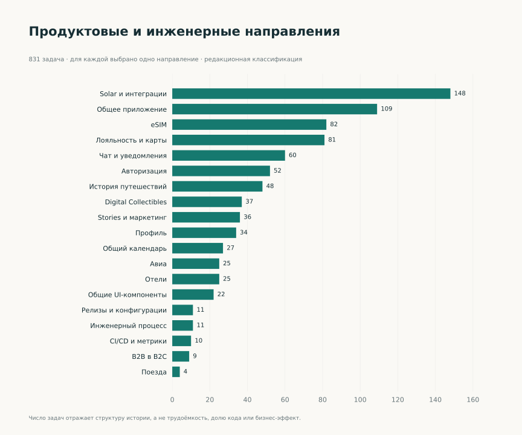

[EN](../en/overview.md) · [Выбор языка / Language](../../README.md)

# Валерий Веселов · iOS Developer

**OneTwoTrip & Solar · 2021–2026**

Разрабатываю пользовательские сценарии в большом модульном iOS-приложении: от авторизации и общих UI-компонентов до eSIM, истории путешествий и платёжных интеграций. Мой опыт также включает автоматизированные проверки, Jenkins, техническую документацию и инструменты анализа репозитория.

Это портфолио о том, какие задачи я решал, как подходил к их реализации и какие инженерные навыки применял. Каждый кейс содержит контекст, мой вклад, примеры работы, технические решения и темы для обсуждения на интервью.

**Начать знакомство:** [резюме](career/summary.md) · [галерея](gallery.md) · [все кейсы](cases/index.md). Все разделы доступны прямо на GitHub.

## Выбрать направление

| Что интересно | С чего начать |
| --- | --- |
| Сквозные продуктовые сценарии | [eSIM](cases/esim.md), [история путешествий](cases/travel-history.md), [платежи](cases/payments.md) |
| Оплата, балансы и финансовые экраны | [eSIM: 3DS, промокоды и таймер](cases/esim.md), [кэшбэк и счета](cases/loyalty.md), [карты и история операций](cases/virtual-card.md) |
| Общие компоненты и архитектура UI | [UI 2.0](cases/design-system.md), [календарь](cases/calendar.md), [Stories](cases/stories.md) |
| Развитие отдельного приложения | [Solar](cases/solar.md), [Digital Collectibles](cases/digital-collectibles.md) |
| Качество и инженерная инфраструктура | [Тестирование](cases/quality.md), [Jenkins](engineering/ci-details.md), [метрики](cases/repository-metrics.md) |
| Эволюция опыта и технологии | [Профессиональный рост](career/growth.md), [технологическая матрица](engineering/technologies.md) |

## Полное портфолио

- [21 подробный кейс](cases/index.md).
- [84 практических примера задач](archive/index.md) — сценарий, мой вклад и инженерный акцент.
- [7 графиков и статистика](statistics.md).
- [Галерея экранов и компонентов](gallery.md).
- [Краткое резюме](career/summary.md).

## Опыт в цифрах

| Показатель | Объём |
| --- | ---: |
| Авторские изменения кода без merge-коммитов | 4 046 |
| Задачи, связанные с собственными изменениями | 831 |
| Принятые авторские pull requests в доступной истории | 342 |
| Коммиты, затрагивающие тестовые файлы | 788 |

Период анализа: **22.12.2021–28.09.2026**. История PR охватывает ноябрь 2024 — сентябрь 2026. Эти показатели описывают масштаб и структуру работы; они не равны количеству выпущенных фич или бизнес-эффекту. [Как читать показатели](methodology.md).

## Как пользоваться портфолио

Для первого знакомства можно прочитать краткое резюме и выбрать два-три кейса, близких к вакансии. В каждом кейсе есть конкретные примеры задач и вопросы для технического разговора. [Каталог практических примеров](archive/index.md) сгруппирован по областям работы; нужную технологию можно найти поиском по странице.

Приложение и дизайн создавались командой. В кейсах описана моя область участия; для недавних инфраструктурных решений с существенной AI-помощью отдельно указана моя роль в постановке, проверке и итерациях. Иллюстрации — snapshot-тесты экранов и компонентов на подготовленных данных; тип каждого изображения указан в галерее.
