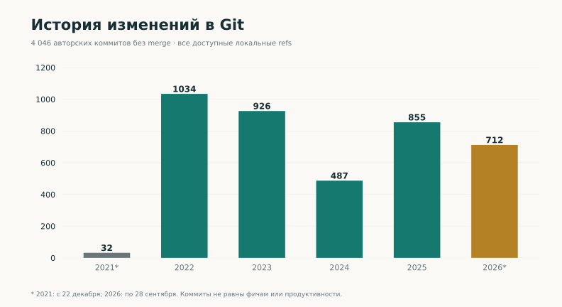
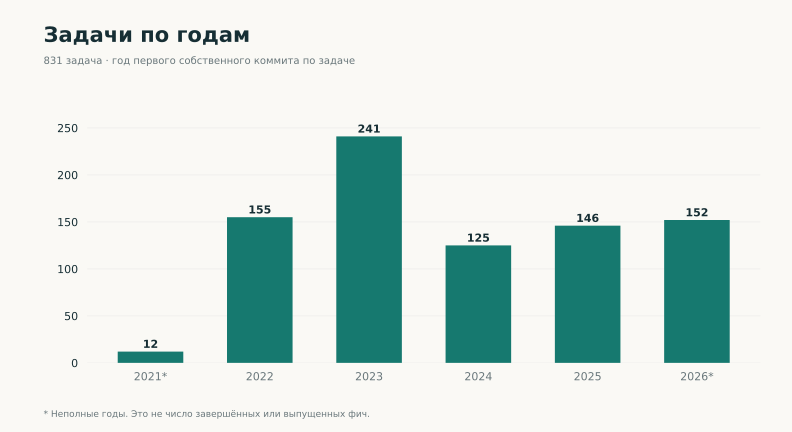
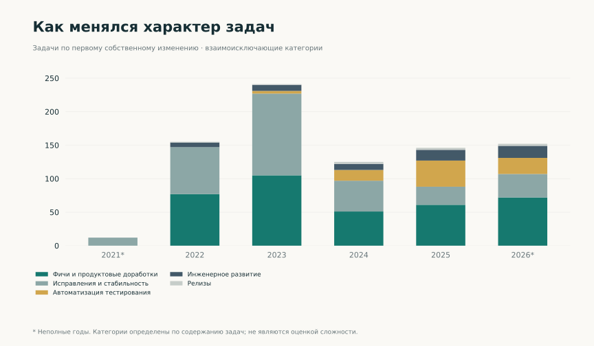
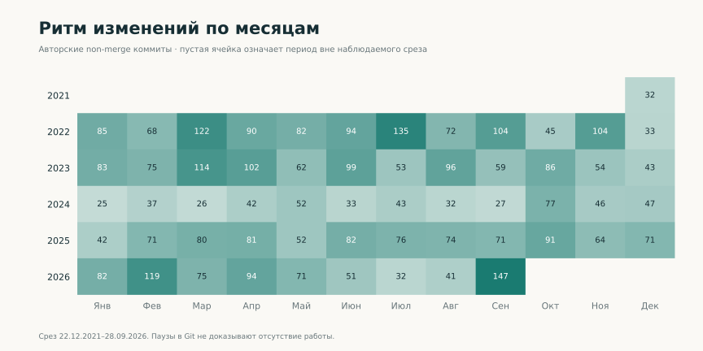
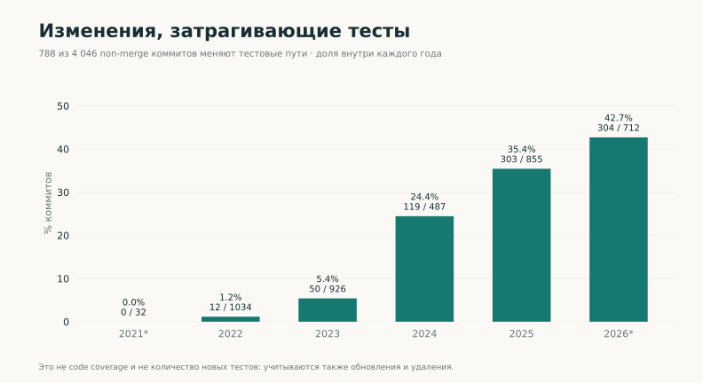
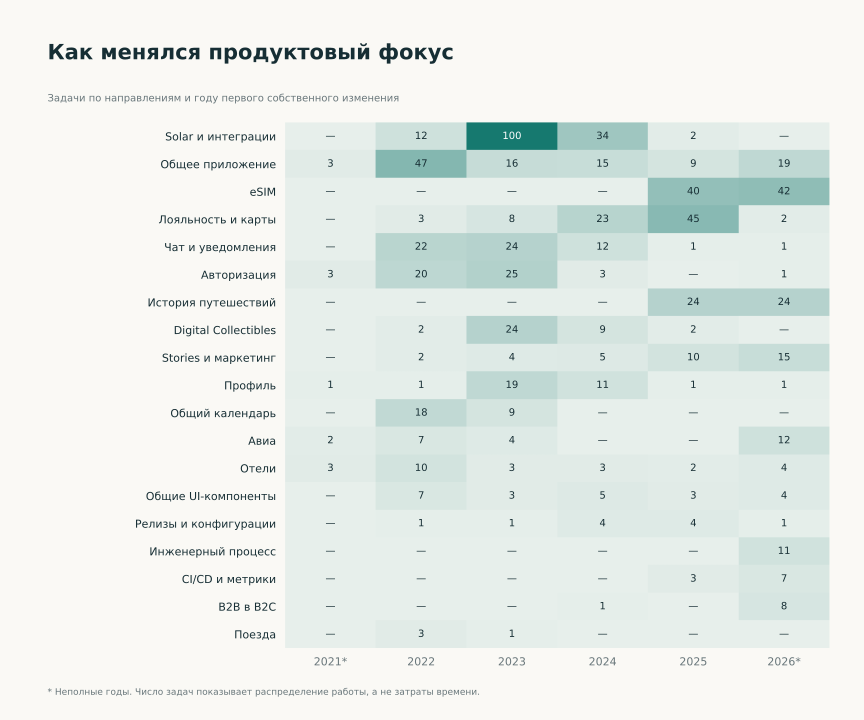

[EN](../en/statistics.md) · [Выбор языка / Language](../../README.md)

# Статистика вклада

Период: **22.12.2021–28.09.2026**. Графики показывают масштаб и структуру инженерной истории. [Кейсы](cases/index.md) раскрывают содержание работы и решения.

## Изменения кода по годам

4 046 авторских коммитов без merge. Разные записи могут представлять переносы одного изменения.

[PNG](../../assets/charts/ru/commits-yearly.png) · [SVG](../../assets/charts/ru/commits-yearly.svg)

## Задачи по годам

831 задача, связанная с собственными изменениями кода. Год соответствует первому изменению по задаче, а не её завершению.

[PNG](../../assets/charts/ru/issues-yearly.png) · [SVG](../../assets/charts/ru/issues-yearly.svg)

## Направления работы

Каждая задача отнесена к одному направлению; классификация подготовлена для портфолио.

[PNG](../../assets/charts/ru/domains.png) · [SVG](../../assets/charts/ru/domains.svg)

## Характер задач

Фичи, исправления, проверки, инженерные изменения и релизы. Количество задач не отражает их трудоёмкость.

[PNG](../../assets/charts/ru/work-mix.png) · [SVG](../../assets/charts/ru/work-mix.svg)

## История по месяцам

Неполные декабрь 2021 и сентябрь 2026. Отсутствие коммитов не означает отсутствие работы.

[PNG](../../assets/charts/ru/monthly.png) · [SVG](../../assets/charts/ru/monthly.svg)

## Работа с тестами

788 коммитов затрагивают тестовые пути. Это не покрытие кода и не число написанных тестов.

[PNG](../../assets/charts/ru/test-work.png) · [SVG](../../assets/charts/ru/test-work.svg)

## Как менялся продуктовый фокус

Распределение задач по направлениям и году первого собственного изменения. В ячейках указано число задач.

[PNG](../../assets/charts/ru/domain-evolution.png) · [SVG](../../assets/charts/ru/domain-evolution.svg)

## Числовая таблица

| Год | Коммиты без merge | Задачи с первым изменением в этом году | Коммиты с тестовыми путями |
| --- | ---: | ---: | ---: |
| 2021* | 32 | 12 | 0 |
| 2022 | 1034 | 155 | 12 |
| 2023 | 926 | 241 | 50 |
| 2024 | 487 | 125 | 119 |
| 2025 | 855 | 146 | 303 |
| 2026* | 712 | 152 | 304 |

*Неполные годы. [Как читать показатели](methodology.md) · [Агрегированные данные](../../data/statistics.json).
